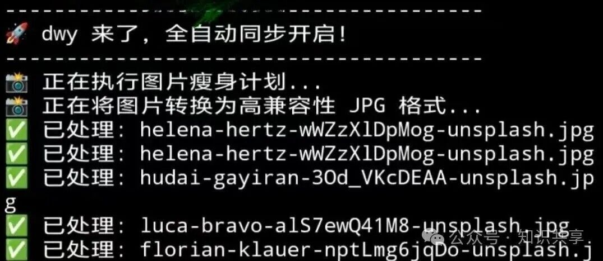
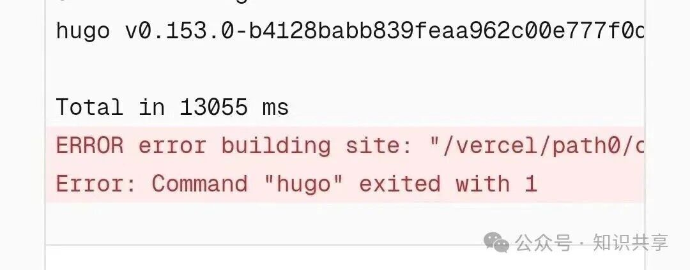
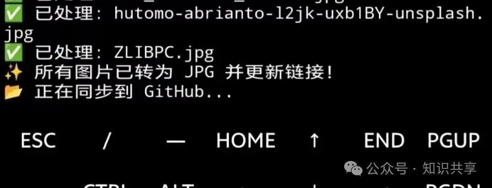

 
我发现很多人的博客断更，其实都受限于那种仪式感。

  

非得有一个安静的下午，非得摆好电脑，非得连上 Wi-Fi。结果就是，灵感在等公交、排队、或者摸鱼的时候蹦出来，等回到家坐在电脑前，那点火花早就熄灭了。

  

所以我干脆做了一件事：把我的博客整个搬进了手机。

  

为什么是手机？不是为了显得特别，而是为了真正的轻快。我的配置很简洁：Obsidian 写稿，Termux 发稿，云端系统部署与加速。

很多人觉得手机屏幕小，写长文或排版会难受。其实写 Markdown 格式的文字，并不依赖大屏。我在手机上用 Obsidian 码字，粘贴照片、链接跳转，手感比电脑还要顺手。

  

最核心的是，我通过 Termux 把博客文件夹直接挂载到了手机目录。这种“前店后厂”的感觉，让我随时随地掏出手机就能进入状态。

  

这里的 Termux，只做一件事——推送。

  

在我的流程里，手机只负责最直接的内容表达。Termux 的存在，是为了给我的文字插上翅膀。至于剩下的繁琐工作：拉取代码、编译静态页面、全网部署，我全部甩给了云端。

  
  
这种本地只管写、云端全自动的架构，让我即使在路边收起手机的瞬间，刚才写下的文字，就已经同步到了全球的边缘节点。

  

关于图片：我为什么坚持本地化与自动压缩？

  

很多博主习惯用图床，但我一直坚持图片本地化。

  

我希望我的博客是一个完整的包裹：文字、图片、配置，全部收纳在一个仓库里。

  

但在手机端处理图片，我曾踩过一个不小的坑。最初为了追求加载速度，我尝试将图片全部转为新型的高压缩比格式（WebP），结果由于手机端转换工具与云端构建引擎的兼容性差异，导致云端解码失败，部署频频报错。

最终我选择了一个更稳妥的方案：回归“兼容性之王”。

  

我通过脚本调用图像处理库，将图片统一转为质量设为 80 的通用 JPG 格式。这样既保证了画质，又将体积缩小了 80% 以上，最重要的是，它彻底解决了云端部署的报错问题。

  

现在的“一键开工”流：

  

为了极致的简单，我甚至把所有操作浓缩成了一个指令。

现在我写完文章，只需在终端轻轻敲入：

> up

> 

接下来，脚本会自动帮我完成所有苦力活：智能压缩图片、地毯式修正文档链接、清理冗余缓存、一键同步仓库。不到一分钟，新文章就会准时上线。

  

很多人问我，这样折腾累不累？

  

其实，把生产力环境浓缩到手机里，本质上是在消除创作门槛。

  

当写一篇随笔变得像发个朋友圈一样简单时，你才不会去在意设备性能、环境配置这些杂事。

  

我们总是习惯于等待一个完美的时机去开始，但事实证明，最好的环境就在你现在的口袋里。打破那种非电脑不可的执念，你会发现，记录本身才是最有价值的事。
